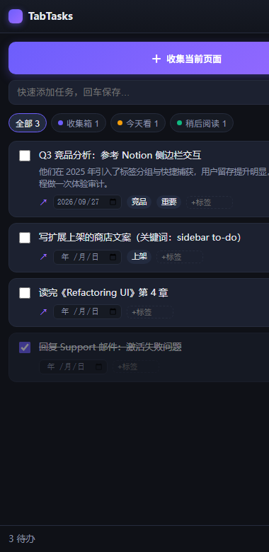
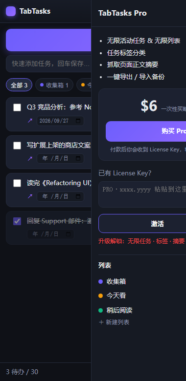

# TabTasks — 侧边栏待办 / 页面收集器（Chrome 扩展）

把「正在看的网页」一键变成待办。纯本地存储、零后端、零第三方 API，
免费+Pro 买断变现，Pro 用 HMAC License Key 门控。对标 Product Hunt 年度榜
第 7 的 [2-b.ai](https://www.producthunt.com/leaderboard/yearly/2026)（Todoist × ChatGPT 侧边栏思路）。

## 界面预览

| Pro 全功能态 | 付费墙（免费用户点升级） |
|---|---|
|  |  |

> 随时本地预览：用浏览器直接打开 `sidepanel.html?demo=pro`（或 `=free` / `=paywall`），
> 页面内置开发桩，不影响真实扩展环境。

---

## 1. 本地加载（先看效果）

1. 打开 Chrome，地址栏输入 `chrome://extensions`
2. 右上角打开 **开发者模式**
3. 点 **加载已解压的扩展程序** → 选择本 `side-task-collector/` 目录
4. 工具栏点扩展图标 → 侧边栏打开；在任意网页点 **「＋ 收集当前页面」**
5. 快捷键 `Alt+Shift+T` 也可把当前页快速收进侧边栏

---

## 2. 免费 / Pro 门控

| 能力 | 免费 | Pro |
|------|:---:|:---:|
| 收集当前页为任务、快速添加 | ✅ | ✅ |
| 到期日、勾选完成、清除已完成 | ✅ | ✅ |
| 活动任务上限 | 30 | 无限 |
| 列表数量上限 | 2 | 无限 |
| 任务标签 | 🔒 | ✅ |
| 抓取页面正文摘要 | 🔒 | ✅ |
| 导出 / 导入备份 | 🔒 | ✅ |

阈值都写在 [`config.js`](config.js) 的 `CONFIG.FREE / PRO`，一行就能调。

---

## 2.5 怎么调免费额度（改一个文件即生效）

打开 [`config.js`](config.js)，改 `FREE` 里的数字，保存后到
`chrome://extensions` 点本扩展的 **重新加载 ⟳** 即生效：

```js
FREE: {
  maxActiveTasks: 30,   // ← 免费活动任务上限，改成 10 / 50 随意
  maxLists: 2,          // ← 免费列表数上限
  tags: false,          // ← 标签是否免费可用（建议保持 false）
  excerpt: false,       // ← 页面正文摘要是否免费
  export: false         // ← 导出备份是否免费
},
```

调参建议（跑自然流量转化的经验值）：上限卡在「轻度用户够用、重度用户心疼」，
先 30/2 上线，一周后看用户反馈再收紧或放宽；改完记得同步商店描述里的 Free/Pro 对比。

---

## 3. 变现：Stripe + Cloudflare Worker（全自动发 Key，整体 0 成本）

> Worker 不查 Stripe API、不用 webhook、不用发邮件：付款成功页的
> `sid`（Checkout Session ID）经 HMAC 派生出**确定性 License Key**直接展示，
> 买完即得。Cloudflare 免费计划（10 万请求/天）远够用。
>
> **逐步部署手册（含 4 处参数对照表与端到端验收清单）见 [`worker/DEPLOY.md`](worker/DEPLOY.md)。**

```
扩展点「购买 Pro」 → Worker /buy → 302 → Stripe 结账页
付款成功 → Stripe 跳回 Worker /success?sid={CHECKOUT_SESSION_ID}
        → 页面展示该买家专属 Key（= HMAC(SECRET, sid)）→ 粘贴回扩展激活
```

**一次性配置（约 10 分钟）：**

> 🧭 **新手推荐**：在本目录运行 `node setup.mjs`，交互式向导会自动完成下面
> 的生成 SECRET、写配置、部署 Worker、回填域名、健康检查，并给你本人
> 签发一把永久 Pro Key；结束后只需去 Stripe 后台粘贴一个 Success URL。
>
> ☁️ 也可在 Cloudflare Dashboard → Workers & Pages → Import from Git 关联
> 本仓库自动部署（Root directory 填 `worker`，Build command 留空，
> 并在 Variables 里添加加密变量 `LIC_SECRET`）。
>
> ⚠️ 运行 `setup.mjs` 后 `config.js` 会包含真实 SECRET——公开仓库请勿再提交该文件
> （本地可 `git update-index --skip-worktree config.js` 让 git 忽略你的改动）。

1. **Stripe**：Dashboard → Payment Links → 新建 $6 一次性付款链接；
   在链接的 *After payment → Confirmation page* 里把 Success URL 设为
   `https://<你的worker域名>/success?sid={CHECKOUT_SESSION_ID}`。
2. **生成一个长随机 SECRET**（三处必须一致：`config.js`、Worker、keygen）：
   `openssl rand -hex 24`
3. **部署 Worker**（代码在 [`worker/`](worker/) 目录）：
   ```bash
   cd worker
   npx wrangler login
   npx wrangler secret put LIC_SECRET     # 粘贴第 2 步的 SECRET
   # 编辑 wrangler.toml 把 STRIPE_PAYMENT_LINK 换成第 1 步的链接
   npx wrangler deploy
   ```
4. **改扩展 `config.js`**：`SECRET` 填第 2 步的值；
   `STRIPE_PAYMENT_LINK` 填 `https://<你的worker域名>/buy`。
5. 重新加载扩展，走一遍 Stripe 测试卡（`4242 4242 4242 4242`）验证闭环。

**手动补发/客服场景**（如买家换机、退款核对）：

```bash
node tools/keygen.mjs --secret "<SECRET>" --sid cs_test_xxxxx   # 由订单 sid 重算出同一把 key
node tools/keygen.mjs --secret "<SECRET>" --days 365 --label x@y.com  # 任意手动签发
```

> 不想用 Worker 也可以退回纯手动模式：成交后自己 keygen 一把 key 邮件发给买家，
> 扩展侧完全不用改。Lemon Squeezy / Paddle / Gumroad 自带自动发 Key，同样兼容本门控格式。

---

## 4. 提交 Chrome Web Store（拿自然流量的关键）

> 📖 **零基础逐步版（含 $5 注册、隐私政策、权限理由、文案、合规避坑）：
> [`docs/chrome-store-publish-guide.md`](docs/chrome-store-publish-guide.md)**

1. 到 [chromewebstore.dev](https://chrome.google.com/webstore/devconsole) 注册（一次性 $5）。
2. 打包上传：把 `side-task-collector/` 目录压成 zip 上传即可
   （商店用 zip，不用 .crx；本目录下 `packtest/` 里的 `.pem` 是本地测试密钥，别打包进去）。
3. **上架文案**（决定搜索流量）：
   - 标题带关键词：`TabTasks: Sidebar To-Do & Page Collector`
   - 覆盖搜索词：to-do、sidebar、read later、web page capture、bookmark organizer、task manager
   - 截图：侧边栏 + 收集前后对比；写清「one click turn a page into a task」。
4. 隐私：本扩展所有数据存本地 `chrome.storage`，不上传服务器——商店问卷如实填“不用于外部目的”。

---

## 5. 安全说明 & 升级路线

当前是 **客户端 HMAC 校验**：Worker 保证了「没付款拿不到合法 sid → 拿不到真 Key」，
但校验用的 SECRET 存在于扩展源码中，能读源码的技术用户理论上仍可自签。
作为独立开发第一版足够。付费用户变多后可升级为：

- 方案 A（改动小）：扩展激活时把 Key 发给 Worker `/verify` 换取短期 token，
  SECRET 只留在 Worker，扩展不再内置校验（Worker 免费额度照样够用）。
- 方案 B：直接用 Lemon Squeezy/Paddle 的 license 激活 API 替换本地校验。

`worker/index.js` 的 `computeKey` 与 `tools/keygen.mjs`、`license.js` 三端算法一致，
迁移时签发逻辑可直接复用。

---

## 目录结构

```
side-task-collector/
├─ manifest.json      # MV3 配置
├─ background.js      # service worker：打开侧栏 + 快捷键捕获
├─ sidepanel.html/css/js  # 侧边栏 UI（内置 ?demo= 预览桩）
├─ config.js          # ★ 只改这里：SECRET / 购买链接 / 免费额度
├─ license.js         # HMAC 校验
├─ icons/             # 16/48/128 图标
├─ worker/            # Cloudflare Worker 收款后端（index.js + wrangler.toml）
├─ previews/          # UI 截图（README 用，打商店 zip 时可删）
├─ dev/               # 本地打包测试密钥，勿提交/勿打包
└─ tools/keygen.mjs   # 手动签发 / 客服补发 Pro Key
```
